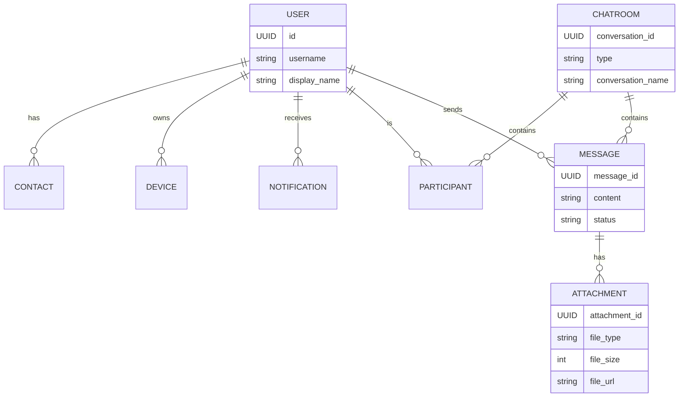
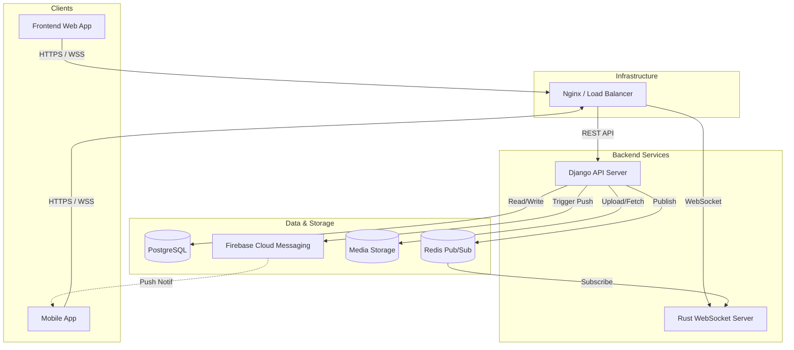
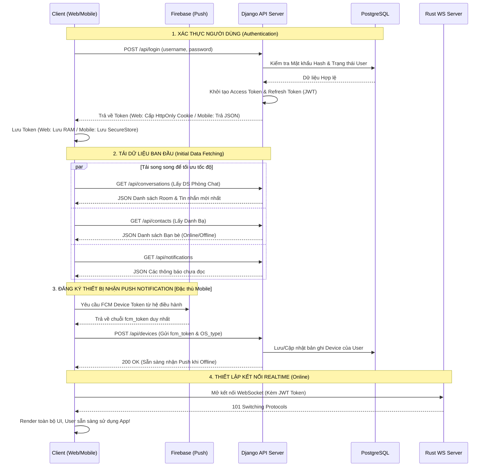
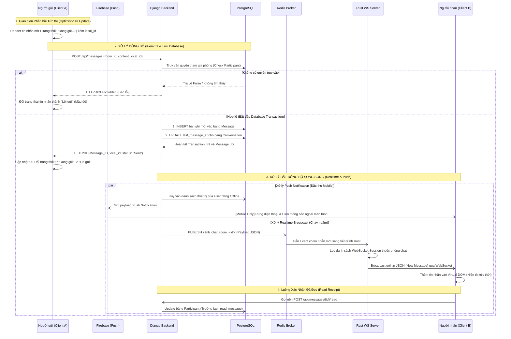
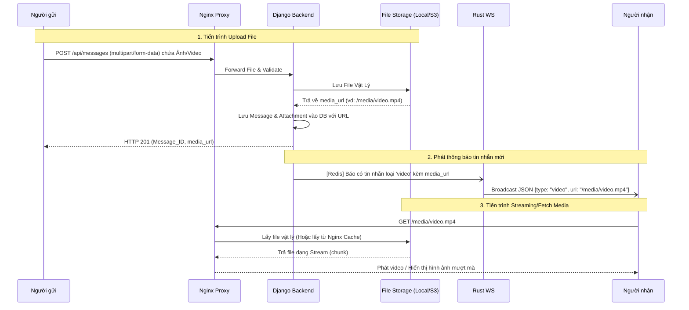
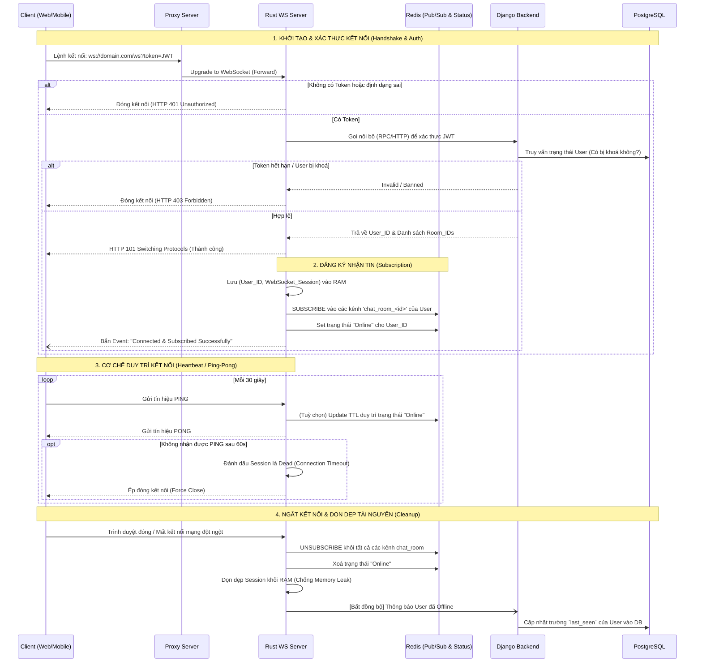

# Các Sơ Đồ Kiến Trúc Hệ Thống (System Diagrams)

Tài liệu này chứa các sơ đồ kỹ thuật trực quan cho dự án Chat. Các sơ đồ đã được chuẩn hoá để dễ nhìn nhất và bao phủ toàn bộ các chức năng từ Authentication, Messaging đến Media Handling.

## 1. Sơ Đồ Thực Thể Liên Kết (Entity Relationship Diagram - ERD)
Thay vì sơ đồ lớp phức tạp, mô hình ERD dưới đây mô tả trực quan cấu trúc Database cốt lõi của hệ thống:

## 2. Sơ Đồ Kiến Trúc Thành Phần (Architecture Components)
Mô tả sự tương tác giữa các service nội bộ và dịch vụ bên thứ ba:

---

## 3. Các Sơ Đồ Tuần Tự (Sequence Diagrams)

### 3.1 Luồng Đăng Nhập & Khởi Tạo Ứng Dụng (Login & Initialization Flow)
Luồng này không chỉ dừng ở việc cấp JWT Token, mà còn mô tả chi tiết chuỗi hành động (chuẩn bị dữ liệu, đăng ký nhận Push Notification, kết nối Realtime) mà Client bắt buộc phải làm ngay sau khi đăng nhập thành công để sẵn sàng trải nghiệm Chat.

### 3.2 Luồng Giao Tiếp Realtime (Gửi/Nhận Tin Nhắn Văn Bản)
Luồng này mô tả toàn bộ vòng đời của một tin nhắn: từ lúc Client cập nhật UI ảo (Optimistic Update), Server kiểm tra quyền, lưu vào DB, cho đến quá trình chạy song song (Phân phát qua Redis & Bắn Push qua Firebase).

### 3.3 Luồng Tải Lên và Xem Đa Phương Tiện (Hình Ảnh / Video / File)
Đối với file tĩnh nặng (Video, Ảnh), hệ thống không truyền file nhị phân qua WebSocket để tránh tắc nghẽn. WebSocket chỉ truyền URL, Client sẽ tự tải file về qua giao thức HTTP tĩnh.

### 3.4 Vòng Đời Kết Nối WebSocket (Connection Lifecycle)
Sơ đồ mô tả chi tiết từ lúc khởi tạo kết nối (Handshake), xác thực bảo mật, đăng ký kênh nhận tin (Subscribe), duy trì kết nối (Heartbeat) cho đến khi người dùng mất mạng và hệ thống dọn dẹp bộ nhớ.

